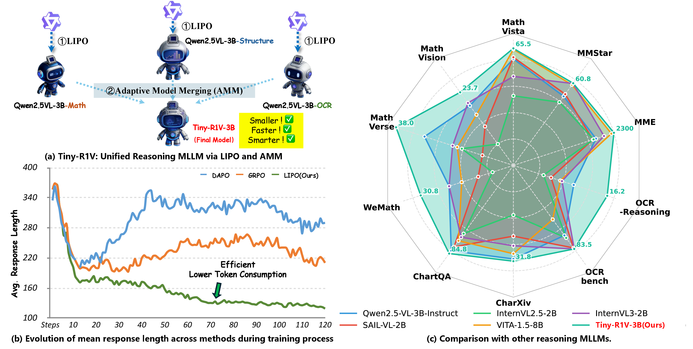
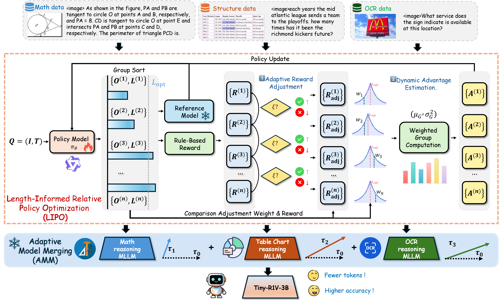

<div align="center">

<h1> Tiny-R1V: Lightweight Multimodal Unified Reasoning Model via Model Merging </h1>

<h5 align="center"> If you find this project useful, please give us a star🌟.

<h5 align="center"> 

<a href='https://arxiv.org/abs/2510.08987'></a>


[Qixiang Yin](https://scholar.google.com.hk/citations?user=Wju65yoAAAAJ&hl=zh-CN)<sup>1,5*</sup>, [Huanjin Yao](https://scholar.google.com.hk/citations?user=pDtsCBQAAAAJ&hl=zh-CN)<sup>2*</sup>, [Jianghao Chen](https://scholar.google.com/citations?user=qnW72HoAAAAJ&hl=en)<sup>5</sup>, [Jiaxing Huang](https://scholar.google.com.hk/citations?user=czirNcwAAAAJ&hl=zh-CN)<sup>2</sup>, [Zhicheng Zhao]()<sup>1,3,4</sup>, [Fei Su]()<sup>1,3,4</sup>

<sup>1</sup> Beijing University of Posts and Telecommunications,  <sup>2</sup>Nanyang Technological University 

<sup>3</sup> Beijing Key Laboratory of Network System and Network Culture

<sup>4</sup> Key Laboratory of Interactive Technology and Experience System, Ministry of Culture and Tourism 

<sup>5</sup> Zhongguancun Academy, Beijing, China

<sup>*</sup>Equal Contribution,       <sup>✉️</sup>Corresponding Author

</h5>
</div>


## 🎙️ News
- **`Oct 10, 2025.`** We release our paper in [arxiv](https://arxiv.org/abs/2510.08987).


## 💡 About Tiny-R1V
Although Multimodal Large Language Models (MLLMs) have demonstrated remarkable capabilities across diverse tasks, they encounter numerous challenges in terms of reasoning efficiency, such as large model size, overthinking, and compromised accuracy in lightweight scenarios. However, research on the reasoning capabilities of lightweight MLLMs is quite lacking. To this end, we propose Tiny-R1V, a novel lightweight 3B model that achieves faster inference and higher accuracy via a two-stage optimization, while unifying multimodal reasoning across multiple tasks and using fewer tokens. In the first stage, Tiny-R1V introduces Length-Informed Relative Policy Optimization (LIPO), a novel reinforcement learning method, to train each reasoning model. The LIPO is designed to dynamically adjusts advantages of responses within groups, that is, by prioritizing concise yet high-quality responses to encourage the generation of shorter and more accurate response. In the second stage, we propose Adaptive Model Merging (AMM), a training-free model merging method that merges multiple specialist models into a unified architecture. Specifically, AMM adaptively adjusts the weights of task vectors and robustly optimizes the merged vectors via a novel gradient projection regularization loss function, thus mitigating redundant conflicts between them. Extensive evaluations on ten widely-used reasoning benchmarks covering mathematics, structured data (charts, tables, documents), OCR, and general capabilities showcase the superior performance of Tiny-R1V, enabling lightweight models to excel in diverse multimodal reasoning tasks.

<div align=center>


</div>
(a)Two-stage framework for training lightweight MLLMs for unified reasoning tasks. (b) The average response length of GRPO, DAPO and LIPO(Ours) on the training set during the RL training process. (c) Tiny-R1V achieves the state-of-the-art performance on a broad range of multimodal reasoning tasks compared with other open source models.


<div align=center>

</div>
Tiny-R1V employs Length-Informed Relative Policy Optimization (LIPO) and Adaptive Model Merging (AMM). In the first stage, Tiny-R1V trains three expert models separately using LIPO, which dynamically adjusts the advantages between groups to minimize the number of response tokens while ensuring the accuracy of the answer. In the second stage, Tiny-R1V merges the three models using AMM, determines the dynamic weights of model parameters, and reduces parameter conflicts, resulting in the final Tiny-R1V-3B model.


## 🔗 Citation
If you find this repository is useful, please star🌟 this repo and cite🖇️ our paper.
```bibtex
@article{yin2025tiny,
  title={Tiny-R1V: Lightweight Multimodal Unified Reasoning Model via Model Merging},
  author={Yin, Qixiang and Yao, Huanjin and Chen, Jianghao and Huang, Jiaxing and Zhao, Zhicheng and Su, Fei},
  journal={arXiv preprint arXiv:2510.08987},
  year={2025}
}
```

## 🙏 Acknowledgment
Our work is primarily based on the following codebases. We are sincerely grateful for their work.
- [EasyR1](https://github.com/hiyouga/EasyR1): We use EasyR1 to fine-tune R1-ShareVL Models.
- [VLMEvalKit](https://github.com/open-compass/VLMEvalKit): We use VLMEvalKit for evaluation.
